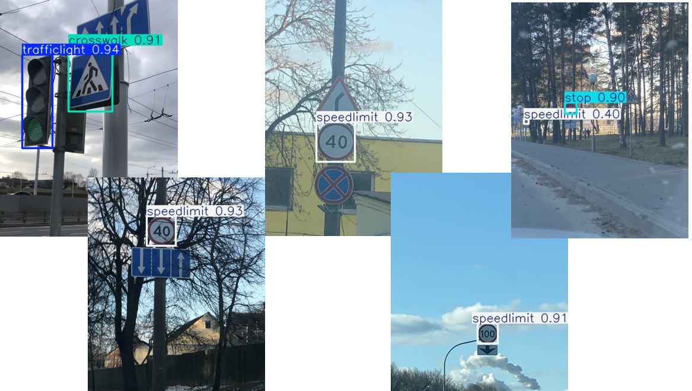

# 🚦 YOLOv8 기반 교통 표지판 객체 탐지 (Traffic Sign Detection)

이 프로젝트는 **YOLOv8** 모델을 사용하여 도로 위의 주요 교통 표지판을 실시간으로 탐지하고 분류하는 인공지능 모델을 학습하고 평가합니다.

## 📋 프로젝트 개요
* **목적**: 자율주행 및 스마트 도로 안전 시스템을 위한 교통 표지판(신호등, 정지, 속도 제한, 횡단보도) 자동 인식.
* **모델**: Ultralytics YOLOv8s (Pre-trained `yolov8s.pt` 가중치 활용).
* **개발 환경**: Google Colab (Tesla T4 GPU 가속기 사용).

## 📊 데이터셋 구성
* **원본 데이터**: `Signpost.zip` (VOC 형식의 XML 어노테이션 포함).
* **탐지 클래스 (총 4종)**: `trafficlight`, `stop`, `speedlimit`, `crosswalk`.
* **데이터 규모**:
    * 전체 이미지: 877장
    * 학습 데이터(Train): 701장 (80%)
    * 테스트 데이터(Test): 176장 (20%)

## 🛠️ 주요 작업 단계
1. **환경 구축**: `ultralytics` 라이브러리 설치 및 어노테이션 변환을 위한 `convert2Yolo` 클론.
2. **데이터 전처리**: 
    * VOC XML 형식을 YOLO 전용 `.txt` 형식으로 변환.
    * 이미지는 `.png` 포맷을 사용하며, 전체 데이터를 8:2 비율로 분할하여 폴더 구조 생성.
3. **학습 설정**:
    * 데이터셋 경로와 클래스 정보가 담긴 `custom_s_voc.yaml` 파일 자동 생성.
4. **모델 학습**:
    * **하이퍼파라미터**: Epochs=20, Batch size=32, Image size=640.
    * **학습 장치**: CUDA GPU(Tesla T4).

## 🚀 실행 방법

### 1. 필수 라이브러리 설치
```bash
pip install ultralytics
git clone [https://github.com/ssaru/convert2Yolo.git](https://github.com/ssaru/convert2Yolo.git)
```

## 📈 학습 결과
* 학습 완료 후 모델의 최적 가중치(`best.pt`)와 성능 지표(PR Curve, Confusion Matrix 등)는 `/content/runs/detect/custom_s` 폴더에 자동으로 저장됩니다.
* YOLOv8s 모델은 약 1,113만 개의 파라미터를 가지며, T4 GPU 환경에서 실시간 탐지에 적합한 빠른 추론 성능을 보입니다.


* test폴더에 들어 있는 이미지 중 랜덤하게 5개를 뽑은 후 예측시킴
* 오른쪽 끝 사진에서 사람 눈으로도 판단하기 어려운 표지판을 제외하고 잘 예측한 것을 볼 수 있습니다. 